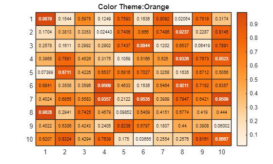

# Open Color MATLAB

This repository provides minimalist RGB color definitions from [Open Color](https://yeun.github.io/open-color/), making it easy to use color themes when plotting graphics in MATLAB.

本仓库提供来自[Open color](https://yeun.github.io/open-color/) 的简约 RGB 颜色定义，方便在MATLAB中使用绘制图形颜色主题。

## Usage

Directly load the 'colormapData.mat' color theme data into your MATLAB workspace.

直接在你MATLAB工作空间中加载“colormapData.mat”颜色主题数据。

```
load colormapData.mat
```

## Requirements

[MathWorks Products](http://www.mathworks.com)

- MATLAB R2022b or later

## Examples

Create a matrix of data. Then create a heatmap of the matrix values, draw the theme colors one by one.

创建一个数据矩阵，然后绘制矩阵值的热图，一个一个地绘制主题颜色。

```matlab
load colormapData.mat
cdata = rand(10);

keyNames = keys(d);
for idx = 1:numEntries(d)
    figure;
    heatmap(cdata);

    cmap = d(keyNames(idx));
    colormap(cmap{:})
    title("Color Theme:"+keyNames(idx));
end
```




## Color Themes


